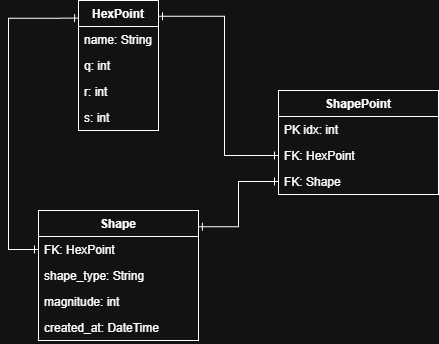

# 12780 Final Project

# Release 1.0.0

## Overview
The project displays a canvas with flat-top hex grid setup where you can create shapes on it by clicking individual hexagon. You will be first taken to a greeting page. Click GoTo button to access the hexagon canvas and all of its functionalities. 

From the project proposal, the translation/rotation operations are omitted as I focus more on drawing and rendering shapes instead. Other functions are implemented. 

## Features
- A hexagon grid canvas display
- Allows for on-click highlight of hexagons
- Allows for shape creation of circles and triangles
    - Must select which shape to create
    - Must enable "Create Shape" button
    - For circle, you must enter a radius for a circle to be valid
    - For triangle, you must click at least 3 vertices for a triangle to be created
- All created shapes will be saved to databse. Allows for export of database entries to .xlsx format.
- Support clean canvas for local drawings. Support clean database to clear all existing entries.

## Database ERD drawing


## How to Run
After building the container, run the server with
```bash
python manage.py runserver 127.0.0.1:8000
```
Then access the starting page by going to http://localhost:8000/ at your browser. 

## How to Test
Run
```bash
pytest ./test_final_proj.py -v
```
in the container terminal to test the build. 